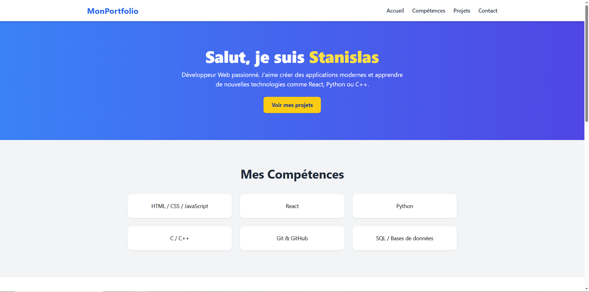
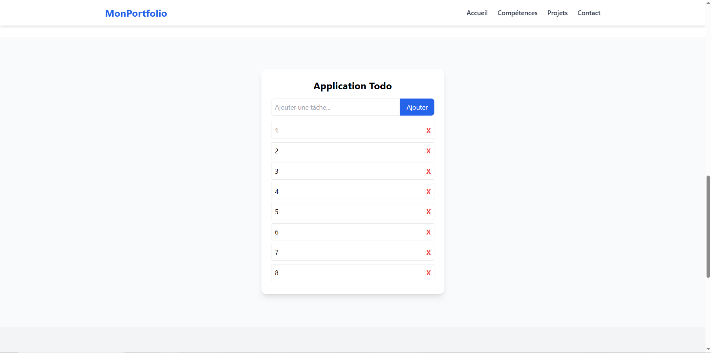

# Mon Portfolio

Bienvenue sur mon portfolio personnel !  
Ce projet regroupe mes travaux, projets, et expériences, ainsi qu’une démo de mes compétences en développement web.

---

## Fonctionnalités

- **Page d’accueil** : présentation rapide
- **Section Projets** : liste de mes réalisations (avec liens vers GitHub/démos)
- **Section Compétences** : technologies et outils que j’utilise
- **Mini-jeux intégrés** 🎮 : comme un Snake codé en React
- **Design responsive** : adapté aux mobiles, tablettes et ordinateurs

---

## Technologies utilisées

- **Frontend** : [React](https://react.dev/), [Tailwind CSS](https://tailwindcss.com/)
- **Routing** : [React Router](https://reactrouter.com/)

---

## 🎮 Mini-jeu Snake

Une petite démo interactive réalisée en React pour montrer mes compétences en **canvas**, **animations** et **gestion d’état**.  
Le jeu contient :
- Un menu d’accueil
- Un système de score
- Un écran *Game Over* avec possibilité de rejouer

---

## Aperçu

### Page d’accueil

### Exemple de projet

### Mini-jeu Snake

---

## Contact

- Email : devfreelance76@gmail.com  
- LinkedIn : [linkedin.com/in/tonprofil](https://github.com/shiro76)  
- GitHub : [https://www.linkedin.com/in/stan-jan-b8ab69199/](https://www.linkedin.com/in/stan-jan-b8ab69199/)  

---

Merci d’avoir visité mon portfolio ! N’hésitez pas à me contacter.
